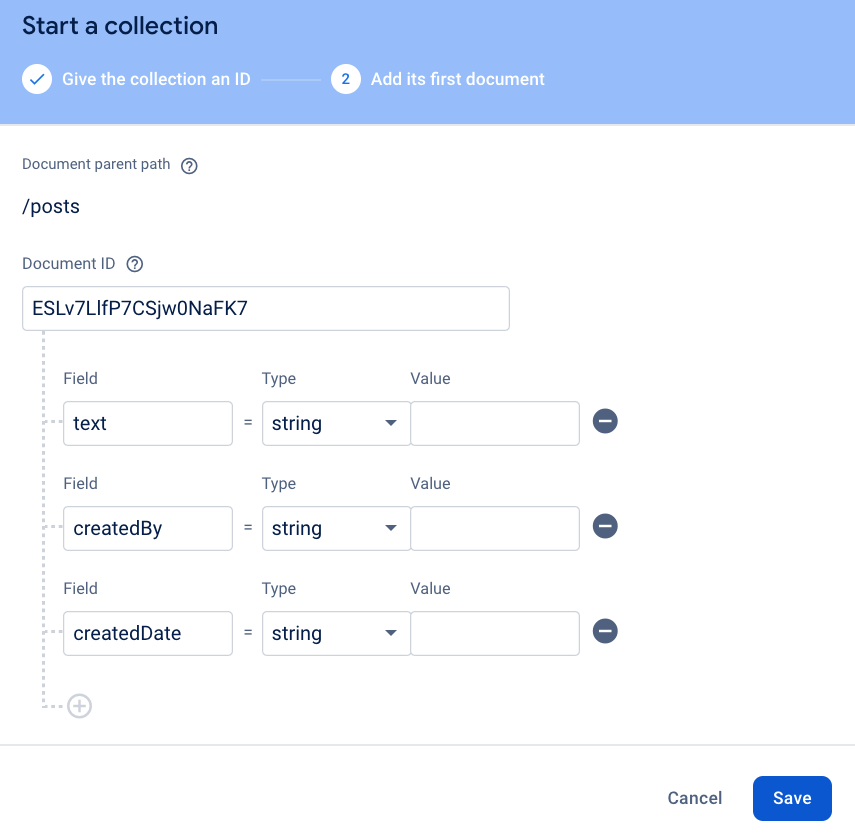

# Genomgång av projekt

### Skapa en "Twitter"-liknande applikation där användare kan skapa posts

Du kan utgå ifrån koden här: https://github.com/AlbinDaleby/crossplatform-mobile. Där har jag uppdaterat koden i `usersApi.ts` för att kunna uppdatera och radera en user.

### Projektet lämnas in individuellt men ni uppmuntras att sitta tillsammans och hjälpa varandra.

## G-Krav

#### 1. Gör det möjligt att redigera en `user` i appen:
  - Visa en "Edit"-knapp bredvid varje user i `UserList`.
    - Förslagsvis kan du navigera användaren till `UserForm` för detta så den både kan skapa och uppdatera users.
    - För att kunna navigera till `UserForm` via `UserInfo` måste vi lägga till en `<UserListStack.Screen name="UserForm" component={UserForm} />` i `UserListStackScreen` i `App.tsx`.
  - Till `UserForm` ska du då skicka med `user` som route.params (se hur vi gjorde för `UserInfo`).
  - Fyll i firstName och lastName med datan vi skickade med.
    - Uppdatera då hur du sätter state till ex. `const [firstName, setFirstName] = useState(route?.params?.user?.firstName || '')`
  - I `UserForm` ska vi i det fallet anropa `updateUser` istället för `createUser`.
  ```jsx
  const [updateUser] = useUpdateUserMutation()
  ...
  updateUser({ user: { id: user.id, firstName: firstName, lastName: lastName }
  })
  ```

#### 2. Gör det möjligt att radera en `user` i appen:
  - Visa en "Delete"-knapp bredvid varje user i `UserList`.
  - Anropa endpoint `deleteUser` från `usersApi.ts`
  ```jsx
  const [deleteUser] = useDeleteUserMutation()
  ...
  deleteUser(id) // <-- id här ska vara en users id.
  ```

#### 3. Gör det möjligt för en inloggad `user` (Användaren från `loggedInAs`) att skapa en `post` där de kan skriva en text:
  - Skapa en ny firebase collection för `posts` med fältet `text`, `createdBy` och `createdDate` Alla ska vara typen "string".
  

  - Skapa en ny fil `postsApi.ts` i `src/store/api/` som hämtar `posts` (du kan förslagsvis kopiera och utgå ifrån `usersApi.ts`.
    - Uppdatera din `store.ts` för att lägga till reducer och middleware från postsApi. Observera att vi även lagt till `postsApi.middleware` nedan. Du kan [läsa mer om middleware här](https://redux-toolkit.js.org/api/getDefaultMiddleware):
	
```jsx
export const store = configureStore({
  reducer: {
    [usersApi.reducerPath]: usersApi.reducer,
    [postsApi.reducerPath]: postsApi.reducer, // <-- lägg till
    auth: authSlice
  },
  middleware: (getDefaultMiddleware) =>
    getDefaultMiddleware().concat(
      usersApi.middleware,
      postsApi.middleware // <-- lägg till
    ),
});
```

  - Skapa en ny `<Tab.Screen>` för `PostForm` /src/screens/PostForm
    - Visa ett textfält med placeholder `post` med state `const [postText, setPostText] = useState('')`
    - Visa en `<Button>` "Create post" som skickar följande värden till `createPost(...)` som du definerat i `postsApi.ts`:
      - `text`=string (sätt till Input-värdet)
      - `createdBy`=string (sätt till loggedInAs.id)
      - `createdDate`=string (sätt till `new Date().toLocaleDateString()`)

  - Lista alla posts i en ny screen `PostList` (/src/screens/PostList) där du visar alla posts i en `<FlatList>`.

#### 4. Ladda upp koden + paketera Appen till en `.apk`-fil
  - Använd `build-android`-skriptet vi skapade i `package.json` för att bygga appen.
  - Skapa sedan ett publikt github-repo eller ladda upp koden direkt på ITHS.
    - Om du laddar upp koden till ITHS; Ta först bort node_modules mappen, zippa och laddar upp.

## VG-Krav
#### 1. Sortera din `UserList` i alfabetisk ordning.
  - Använd då gärna [useMemo](https://react.dev/reference/react/useMemo) så sorteringen endast sker när det är nödvändigt.

#### 2. När en användare raderas, Radera även alla posts den användaren har skapat.

#### 3. Gör det möjligt att markera flera användare samtidigt i din `<FlatList>` med hjälp av `<Checkbox>`.
  - När en eller flera användare är markerade ska en knapp visas för "Bulk delete".
  - **Tips**: För att kunna ha ha en state för "checked" på varje element måste du bryta ut varje element i din `<FlatList>` till sin egna komponent. e.x `<UserItem>`.

#### 4. Gör det möjligt för användaren som skapade en post att radera den. Användare ska alltså bara kunna radera posts de själva skapat. Kolla då fältet `createdBy`.

#### 5. Lägg till ett nytt fält `private` (typen boolean i firebase) på `posts`.
  - Användare kan välja att checka i en `<CheckBox>` när de skapar en post som sätter en post till `private`. [Läs om checkbox för react-native-elements här](https://reactnativeelements.com/docs/components/checkbox)
  - posts som är `private` ska endast vara synliga för användaren som skapade den posten.
## Bonus
#### 1. Gör det möjligt för användare att gilla en `post`.
  - Visa då "like-count" bredvid varje post. Tänk på att spara vilken användare det var som gillade posten så de kan ta bort sin "like" från en post.

#### 2. Visa alla `posts` en användare har skapat när du går in på den användarens `UserInfo`
